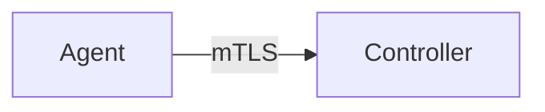
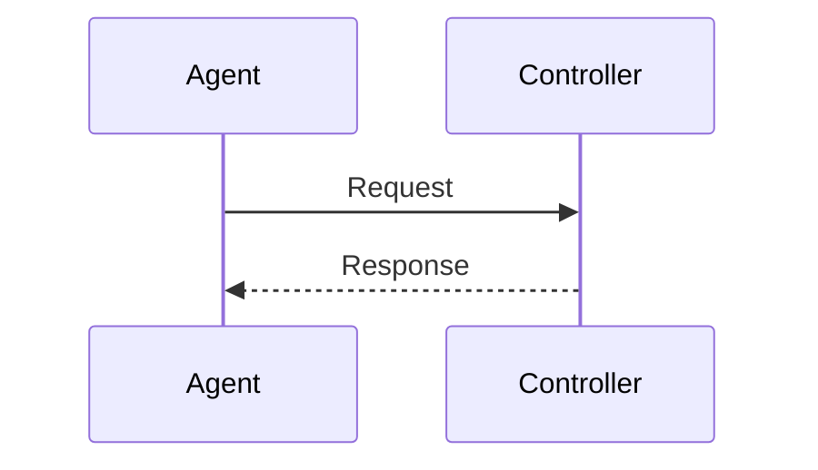

## SPEC: Title

Provide a concise, descriptive title (e.g., "SPEC: Controller enrollment flow").

## Goals
- What this change aims to accomplish.

## Non-Goals
- What is explicitly out of scope for this PR.

## Architecture Overview
- High-level architecture description of the components involved.

## Detailed Design
- Protocols, data models, interfaces (include message schemas or field definitions).
- State machines and error handling.

## Security Posture
- Authentication, authorization, encryption, input validation, abuse mitigation.

## Operations
- Deployment considerations, configuration, rotation/rollout, failure domains.

## Acceptance Criteria
- Testable outcomes for reviewers to validate.

## Open Questions
- Items that need team input.

## Type of Change
- [ ] Feature
- [ ] Bug fix
- [ ] Documentation
- [ ] CI/Infra

## Checklist
- [ ] Includes at least one mermaid diagram (flowchart/sequence/ERD)
- [ ] Security impact considered (authn/z, input validation, secrets)
- [ ] Clippy clean, rustfmt clean, CI green (if code is included)
