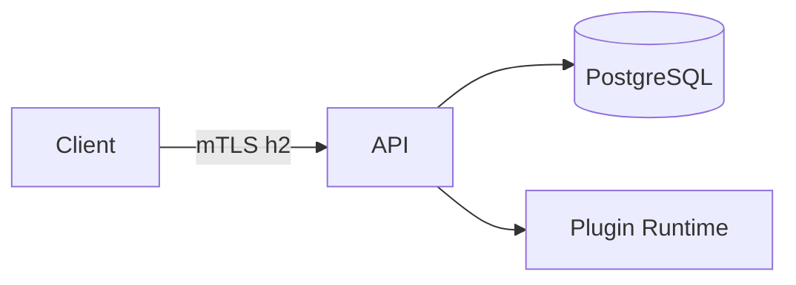
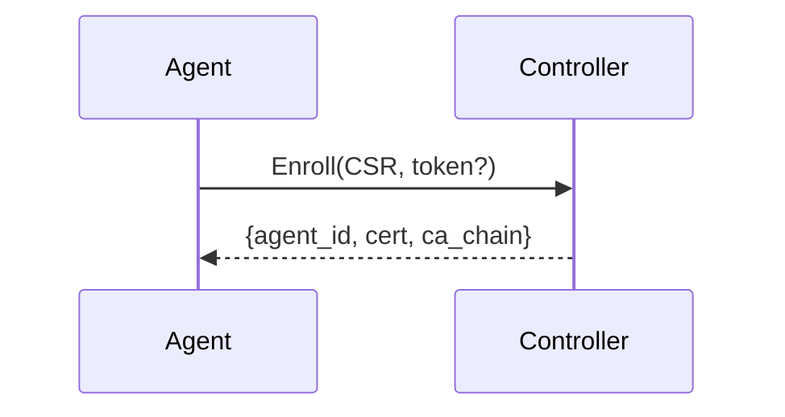
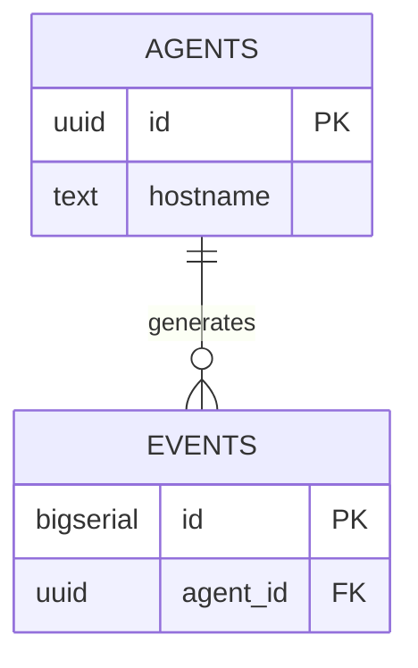

# SPEC Standards (PR Content)

This project requires a SPEC‑first pull request process. Use this guide to produce consistent, reviewable specifications.

## Required Sections
- Goals
- Non‑Goals
- Architecture Overview (with at least one mermaid diagram)
- Detailed Design (protocols, schemas, state machines, error handling)
- Security Posture
- Operations (deploy/config/rotation/rollouts)
- Acceptance Criteria
- Open Questions

## Diagrams
- Flowchart (topologies and data flow)
- Sequence (protocol handshakes and request/response flows)
- ER Diagram (entities and relationships)

Example flowchart:

Example sequence:

Example ERD:

## Writing Tips
- Prefer declarative language and precise definitions.
- Include field names, types, constraints for new/changed APIs.
- Call out security assumptions and mitigations.
- Bound inputs and outputs (size limits, timeouts).

## Review Checklist (for authors)
- [ ] All required sections present.
- [ ] At least one mermaid diagram included.
- [ ] Security posture described and threat surfaces identified.
- [ ] Acceptance criteria are testable and unambiguous.
