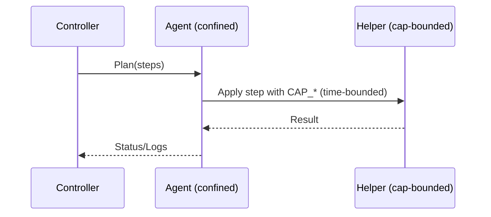

# SPEC: Agent Isolation, Privilege, and Apply Flow

## Goals
- Constrain agent processes; minimize privileges; define safe apply/rollback.
- Support on-host operations for firewall, WAF, LSM, AV/IDS with least privilege.

## Non-Goals
- Tool internals beyond apply interfaces.

## Architecture Overview
- Agent runs unprivileged; spawns short-lived helpers with bounded capabilities per operation.
- Apply flow stages configuration, validates, atomically switches, probes health, and rolls back on failure.

## Detailed Design
- Confinement: seccomp-bpf, user namespaces, cgroups, AppArmor/SELinux profiles.
- Capabilities: grant CAP_NET_ADMIN only for nftables step; drop after; no ambient caps.
- Staging: write to temp dir; validate syntax; switch via atomic symlink or tool-native transaction.
- Health: pre-defined probes; immediate rollback if probes fail; cooldown before retry.

## Security Posture
- Minimize time-in-capability; log all escalations; deny permanent elevation.
- No direct network/file writes outside designated paths.

## Operations
- OS support matrix; fallbacks for distros; profile packaging and updates.

## Acceptance Criteria
- Documented helper capabilities per plugin category; apply/rollback sequence; probes and backoff.

## Open Questions
- Common helper framework vs per-plugin helpers.
