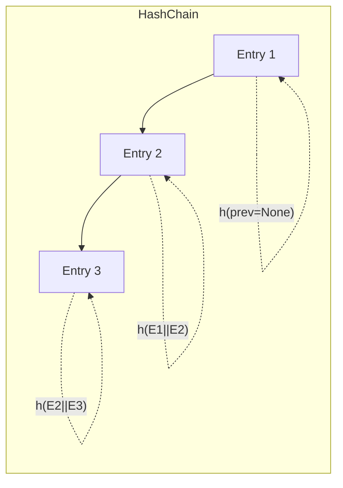

# SPEC: Append-Only Audit Log with Hash Chaining

## Goals
- Provide tamper-evident audit logging for security-critical actions.

## Non-Goals
- External transparency log deployment (optional future).

## Architecture Overview
- Each audit entry includes the hash of the previous entry; batches can be signed; periodic anchoring optional.

## Detailed Design
- Entry fields: ts, actor, action, details JSON, prev_hash, this_hash; signatures optional.
- Verification: periodic jobs recompute chain; alert on mismatch.
- Export: signed snapshots for offline verification.

## Security Posture
- Tamper evident; strict access to write path; read access widely available.

## Operations
- Snapshots at intervals; verification logs; optional external anchoring.

## Acceptance Criteria
- Hash chaining spec; verification procedure; export/import of signed snapshots.
