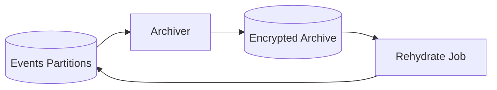

# SPEC: Data Retention, Partitioning, and Archival

## Goals
- Define retention policies by tenant/severity; partition events for performance; specify archival/rehydration.

## Non-Goals
- Full cold storage system implementation.

## Architecture Overview
- Events table partitioned by time (monthly) and optionally by tenant.
- Archival moves old partitions to object storage (e.g., S3/MinIO) with encryption; rehydration on demand.

## Detailed Design
- Partitions: monthly by default; indexes on ts, agent_id, source, level; GIN on details.
- Retention policy: per-tenant/severity; example: critical/errors 180d, info/debug 30–60d.
- Archival: compress and encrypt partitions; store checksums and manifests; verify on restore.
- Rehydration: restore partition to staging, validate, attach back read-only.

## Security Posture
- Archives encrypted with per-environment keys; access controls logged and reviewed.

## Operations
- Scheduled partition creation and archival jobs; monitoring of storage use; alerts on failures.

## Acceptance Criteria
- Retention tiers defined; partitioning scheme documented; archival/rehydration process specified with validation.
