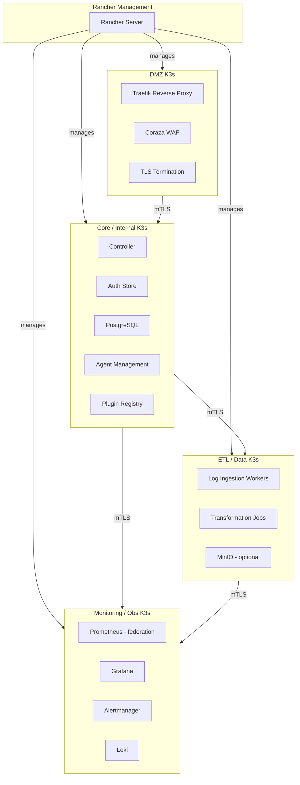
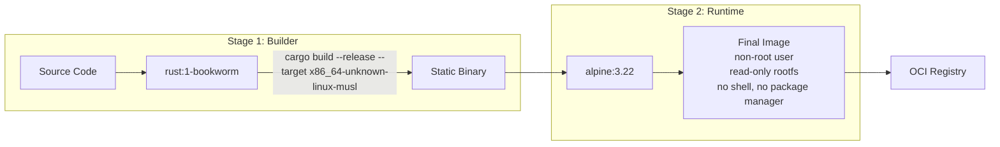
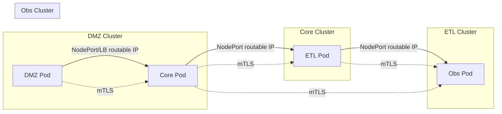

# SPEC: K3s Infrastructure Deployment

## Goals
- Define a production-grade K3s deployment topology for SWAP across four isolated cluster zones (Core, DMZ, ETL/Data, Monitoring/Obs) with an optional Rancher management cluster.
- Standardise Alpine 3.22-based container images built as musl-static Rust binaries.
- Establish inter-cluster networking via routable IPs and mTLS -- no shared overlay network.
- Provide a clear Helm chart structure and operational runbook for day-2 management.

## Non-Goals
- Running all SWAP components in a single monolithic cluster.
- Using a managed Kubernetes service (EKS, GKE, AKS); this spec targets bare-metal and VM deployments.
- Replacing the SWAP PKI with K3s internal PKI -- the two remain separate (see `docs/security/pki_enrollment_spec.md`).
- Prescribing specific hardware; node sizing is left to capacity-planning documentation.

## Architecture Overview

Four K3s clusters are deployed in separate network zones. Each cluster is self-contained with its own control plane, CNI, and etcd. An optional Rancher instance provides fleet-level visibility and GitOps-driven configuration across all clusters.



### Per-Cluster Composition

| Cluster | Workloads | Notes |
|---------|-----------|-------|
| **Core/Internal** | Controller, Auth Store, PostgreSQL (StatefulSet), Agent Management, Plugin Registry | Primary data plane; highest trust zone |
| **DMZ** | Traefik ingress, Coraza WAF sidecar, TLS termination | Only cluster with public-facing endpoints |
| **ETL/Data** | Log ingestion workers (Deployments), transformation CronJobs, MinIO (optional) | Scales horizontally for burst ingestion |
| **Monitoring/Obs** | Prometheus (federated), Grafana, Alertmanager, Loki | Scrapes all clusters; receives push from ETL |
| **Rancher (optional)** | Rancher Server, Fleet controller | Dedicated cluster in production; co-located on Core for dev/staging |

## Detailed Design

### Container Image Build Pipeline

All SWAP images follow a two-stage build producing minimal Alpine 3.22 runtime images.



Key properties of the runtime image:

- Base: `alpine:3.22` (musl libc compatible).
- Binary: statically linked via `x86_64-unknown-linux-musl` target; no runtime library dependencies.
- User: non-root (`uid=10001`, `gid=10001`).
- Filesystem: read-only root; `tmpfs` at `/tmp` and `/run`.
- Removed: shell, package manager, all dev tooling stripped in final stage.
- Signing: images signed with cosign; provenance attestation attached (see `docs/ops/supply_chain_release_spec.md`).

### K3s Cluster Configuration

Each K3s cluster is deployed with:

- **Embedded etcd** for HA (3-node control plane minimum in production).
- **`--secrets-encryption`** flag enabled on all server nodes to encrypt Secrets at rest in etcd.
- **Flannel VXLAN** as the default CNI (per-cluster); no shared CNI across clusters.
- **Traefik disabled** on non-DMZ clusters (`--disable=traefik`); DMZ cluster uses Traefik with Coraza WAF middleware.
- **ServiceLB disabled** on Core/ETL/Obs clusters where external access is not required (`--disable=servicelb`).

#### nftables Namespace Isolation

K3s (via kube-proxy in iptables/nftables mode) manages its own firewall rules. To avoid conflicts with SWAP-managed nftables rules:

- SWAP rules live in a dedicated nftables table: `table inet swap_policy`.
- K3s/kube-proxy rules remain in the default `filter`/`nat` tables.
- A startup script validates that no chain name collisions exist between the `swap_policy` table and kube-proxy-managed chains.
- The SWAP nftables plugin (see `docs/plugins/nftables_ui_spec.md`) is aware of this separation and never writes to kube-proxy-owned chains.

### Inter-Cluster Networking



Principles:

- **No shared overlay network** between clusters. All inter-cluster communication uses routable IPs (host network or LoadBalancer VIPs) plus mTLS.
- **mTLS certificates** are issued by the SWAP PKI (not the K3s internal CA). See `docs/security/pki_enrollment_spec.md`.
- **NodePort or LoadBalancer** services expose inter-cluster endpoints. In production, a dedicated LoadBalancer (MetalLB or hardware) provides stable VIPs.
- **NetworkPolicy** enforces default-deny ingress on every namespace; explicit allow rules are defined per service pair.
- **DNS**: each cluster runs its own CoreDNS. Cross-cluster service discovery uses ExternalName services or static endpoint configuration managed via Helm values.

### SWAP PKI vs K3s Internal PKI

| Concern | PKI | Notes |
|---------|-----|-------|
| Kubelet, API server, etcd peer certs | K3s internal CA | Managed automatically by K3s |
| Inter-cluster mTLS (service-to-service) | SWAP CA | Issued via SWAP enrollment; rotated independently |
| Agent-to-Controller mTLS | SWAP CA | See `docs/security/pki_enrollment_spec.md` |
| Ingress TLS (public-facing) | External CA / ACME | DMZ cluster only |

The two PKI hierarchies never share trust roots. K3s internal certificates are not used outside their respective cluster boundary.

### Management Plane

- **Headlamp**: deployed as an in-cluster Deployment on each K3s cluster for per-cluster dashboarding and ad-hoc inspection. Access gated by RBAC ServiceAccounts scoped to read-only by default.
- **Rancher**: optional fleet management layer. In production, runs on a dedicated single-node K3s cluster. In dev/staging, co-located on the Core cluster. Rancher provides:
  - Centralized cluster registration and lifecycle management.
  - GitOps-driven Helm chart deployment via Fleet.
  - Unified RBAC view across clusters (Rancher RBAC maps to per-cluster Kubernetes RBAC).
  - Cluster health monitoring and alerting integration.

### Agents

SWAP agents are deployed in two modes:

| Mode | Where | Mechanism |
|------|-------|-----------|
| **DaemonSet pods** | K3s host nodes | Runs on every K3s node; mounts host filesystem read-only for inspection; uses hostNetwork for nftables management |
| **Standalone binary** | External hosts (non-K3s) | Installed via package or container; connects to Controller over mTLS; managed via Agent Management API |

DaemonSet agents run with `hostPID: true` and `hostNetwork: true` but still enforce `readOnlyRootFilesystem: true`, `runAsNonRoot: true` (where possible), and drop all capabilities except the minimum required set (`NET_ADMIN` for nftables, `SYS_PTRACE` for process inspection).

### Storage Classes

| Environment | Storage Class | Backend | Notes |
|-------------|--------------|---------|-------|
| Dev / CI | `local-path` | K3s built-in local-path-provisioner | Single-node; no replication |
| Production | `longhorn` | Longhorn distributed block storage | 2-replica minimum; snapshot-based backup |

- PostgreSQL and MinIO StatefulSets use PersistentVolumeClaims bound to the appropriate storage class.
- Longhorn is deployed via its Helm chart on production clusters; configured with daily snapshot schedules and S3-compatible offsite backup targets.
- Secrets encryption at rest is handled by K3s `--secrets-encryption`; volume-level encryption (LUKS) is recommended for production nodes.

### Helm Chart Structure

```
charts/
  swap-core/           # Controller, Auth Store, Agent Mgmt, Plugin Registry
    templates/
      deployment.yaml
      statefulset-pg.yaml
      service.yaml
      networkpolicy.yaml
      secret.yaml        # references external secret; see docs/security/secrets_management_spec.md
    values.yaml
  swap-dmz/            # Traefik, Coraza WAF sidecar
    templates/
    values.yaml
  swap-etl/            # Ingestion workers, transformation jobs, MinIO
    templates/
    values.yaml
  swap-obs/            # Prometheus, Grafana, Alertmanager, Loki
    templates/
    values.yaml
  swap-agent/          # DaemonSet agent
    templates/
      daemonset.yaml
      networkpolicy.yaml
    values.yaml
  swap-common/         # Shared templates (NetworkPolicy defaults, SecurityContext helpers)
    templates/
    values.yaml
```

Each chart includes:

- `NetworkPolicy` templates with default-deny ingress and explicit allow rules.
- `SecurityContext` defaults applied via `swap-common` helper templates.
- Values files with per-environment overrides (`values-dev.yaml`, `values-staging.yaml`, `values-prod.yaml`).

## Security Posture

### Pod Security

All SWAP pods enforce the following `securityContext`:

```yaml
securityContext:
  runAsNonRoot: true
  runAsUser: 10001
  runAsGroup: 10001
  readOnlyRootFilesystem: true
  allowPrivilegeEscalation: false
  capabilities:
    drop:
      - ALL
```

Exceptions (DaemonSet agents only, documented and audited):

```yaml
securityContext:
  capabilities:
    drop:
      - ALL
    add:
      - NET_ADMIN    # nftables rule management
      - SYS_PTRACE   # process inspection
```

### Network Policy

- Every namespace has a default-deny ingress `NetworkPolicy`.
- Explicit allow rules are scoped to specific pod selectors and ports.
- Egress policies restrict outbound traffic to known destinations (other SWAP services, DNS, NTP).

### Secrets Management

- Kubernetes Secrets are encrypted at rest via K3s `--secrets-encryption`.
- Application-level secrets (database credentials, PKI keys) follow the external secrets workflow defined in `docs/security/secrets_management_spec.md`.
- No secrets are baked into container images.

### Runtime

- No SSH into containers or nodes in production.
- Audit logging enabled on the K3s API server (`--kube-apiserver-arg=audit-log-path=/var/log/k3s-audit.log`).
- Pod Security Standards enforced at the namespace level (`restricted` profile for all namespaces except `kube-system`).

## Operations

### Deployment

- Initial cluster bootstrap uses `k3sup` or equivalent automation.
- Helm charts are deployed via Rancher Fleet (GitOps) or `helm install` for standalone environments.
- Upgrade procedures follow `docs/ops/upgrades_spec.md`; K3s binary upgrades use the system-upgrade-controller.

### Monitoring

- Each cluster exposes metrics to the Monitoring/Obs cluster via Prometheus federation over mTLS.
- Grafana dashboards are provisioned as ConfigMaps within the `swap-obs` chart.
- Alertmanager routes follow the escalation paths defined in `docs/ops/observability_metrics_spec.md`.

### Backup and Recovery

- etcd snapshots taken every 6 hours on all clusters; retained for 7 days.
- Longhorn volume snapshots taken daily; replicated offsite.
- Disaster recovery runbook covers single-node failure, full cluster rebuild, and cross-cluster failover scenarios.

### Scaling

- ETL/Data cluster supports Horizontal Pod Autoscaler on ingestion workers.
- Core cluster PostgreSQL scales vertically; read replicas for query-heavy workloads.
- Additional K3s agent nodes are joined via standard `k3s agent` with the cluster token.

## Acceptance Criteria

- Four K3s clusters deploy successfully with embedded etcd HA (3 control-plane nodes each in production).
- All SWAP container images build from `rust:1-bookworm` builder to `alpine:3.22` runtime with zero CVEs in the runtime layer.
- Inter-cluster mTLS connections establish using SWAP PKI certificates; K3s internal PKI is not exposed across cluster boundaries.
- Default-deny `NetworkPolicy` is enforced in every namespace; only explicitly allowed traffic flows.
- All pods pass Pod Security Standards `restricted` profile validation (except documented DaemonSet exceptions).
- K3s `--secrets-encryption` is verified active on all clusters via `k3s secrets-encrypt status`.
- SWAP nftables rules and kube-proxy rules coexist without chain collisions (validated by startup check).
- Headlamp is accessible per-cluster; Rancher (when deployed) registers and manages all four clusters.
- Helm charts install cleanly with `helm install --dry-run` against all target environments.
- Storage classes (`local-path` for dev, `longhorn` for production) provision volumes successfully for StatefulSet workloads.
