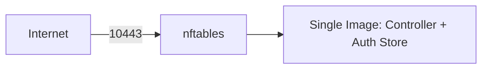

# SPEC: Single Docker Image Deployment (Embedded Auth Store)

## Goals
- Deliver the application as a single hardened Docker image (no SSH, no proxies), with an embedded encrypted auth store.

## Non-Goals
- Bundling PostgreSQL in the image; the main configuration database remains external.

## Architecture Overview
- The image contains the controller binary and the embedded credentials store; exposes port 10443 only.
- Host firewall (nftables) restricts inbound traffic to 10443.

## Detailed Design
- Process: non-root user, read-only filesystem, cap-drop=ALL, tmpfs for `/tmp` and `/run`.
- TLS: self-signed on first run if enabled; weekly rotation on restart.
- Auth: default admin created on first run; password printed once to logs and to `/app/auth/INITIAL_ADMIN.txt` (0600); must change on first login.
- Volumes: bind mounts for certs and plugins; auth store persisted within container data path.

## Security Posture
- Minimal attack surface; strict runtime hardening; no SSH.

## Operations
- Restart weekly for TLS rotation; change default admin immediately; monitor honey endpoints and rate limits.

## Acceptance Criteria
- Single image meets runtime hardening; only 10443 exposed; default admin provisioned with forced password change.
