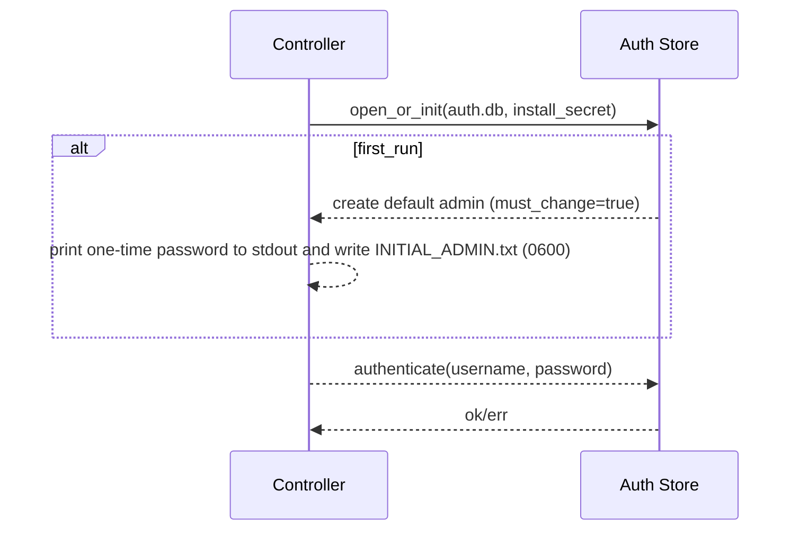

# IMPLEMENTATION PLAN: Auth Store Scaffolding and Initial Admin Flow

## Goals
- Implement the standalone encrypted credentials store (per SPEC #43).
- Create default admin user on first run; display one-time password; force change at first login.
- Integrate with SSR sessions (SPEC #34) and RBAC (SPEC #42); keep single image design (SPEC #44).

## Non-Goals
- Passkeys/WebAuthn; external IdP flows.

## Architecture Overview
- Crate `auth_store`: encrypted on-disk DB at `/app/auth/auth.db` (0600); Argon2id password hashing + pepper; AEAD envelope encryption; optional OS KMS/TPM sealing.
- Controller startup: initialize store if missing; generate install secret if absent; create default admin; emit credentials one-time.

## Detailed Tasks
1) Crate `auth_store`
   - API: open_or_init(path, install_secret?), create_default_admin(), get_user(), set_password(), verify_password(), lockout tracking.
   - Crypto: Argon2id(salt per user, pepper from install secret). AEAD: XChaCha20-Poly1305 for record encryption; metadata monotonic counters.
   - Data model: users (uuid, username unique, pass_hash, role, created_at, last_login_at, must_change_password, failed_attempts, locked_until).
2) Controller integration
   - Env/config for install secret (or generate on first run).
   - On `auth.db` absent: initialize, create default admin, log once + write `/app/auth/INITIAL_ADMIN.txt` (0600).
   - Enforce `must_change_password` at first login; block other actions until changed.
3) Admin password change flow
   - SSR form with CSRF token; on success: rotate session; delete initial file; audit event.
4) Lockout & rate limiting
   - Increment failed attempts; exponential backoff; temporary lockout; audit auth events.
5) Tests
   - Unit: hash/verify, AEAD roundtrip, lockout logic.
   - Integration: first run bootstrap, one-time display, must-change enforcement.

## Security Considerations
- Secrets never logged; INITIAL_ADMIN.txt created with 0600 perms; deleted after first successful password change.
- Install secret provided securely (env/file) and optionally sealed via OS KMS/TPM.

## Acceptance Criteria
- Auth store crate compiles and passes tests; controller bootstraps default admin; must-change enforced; lockout works; audit events recorded.
