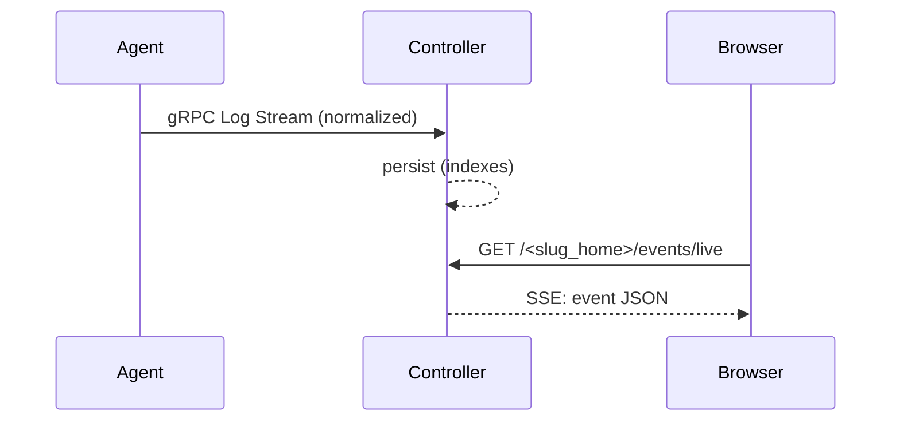

# IMPLEMENTATION PLAN: Event Ingestion Path and Live SSE Tail API

## Goals
- Implement controller ingestion of agent log streams into events table.
- Provide live SSE tail endpoint with filters and backpressure.

## Ingestion
- gRPC LogService.Stream persists normalized events (per SPEC #12) with severity mapping and details JSON.
- Indexes: ts, agent_id, source, level; GIN(details).
- Backpressure: apply size/time caps; drop/flag oversize entries; audit anomalies.

## Live SSE API
- Endpoint: GET `/<slug_home>/events/live?s=severity&src=source&aid=agent&since=ts`
- Transport: SSE default (SPEC #36); last-event-id reconnection; heartbeats.
- Rate limits: per-connection and per-identity; max events/sec and window.

## Tasks
1) Implement gRPC stream handler to persist events and enforce caps.
2) Add SSE endpoint with filters; serialize canonicalized JSON; implement heartbeats and last-event-id.
3) Rate limiting middleware for SSE connections and bytes/sec windows.
4) Tests: ingestion persistence, SSE filters and reconnection behavior.

## Acceptance Criteria
- Normalized events persisted; SSE streaming works with filters and reconnection; rate limits applied.
