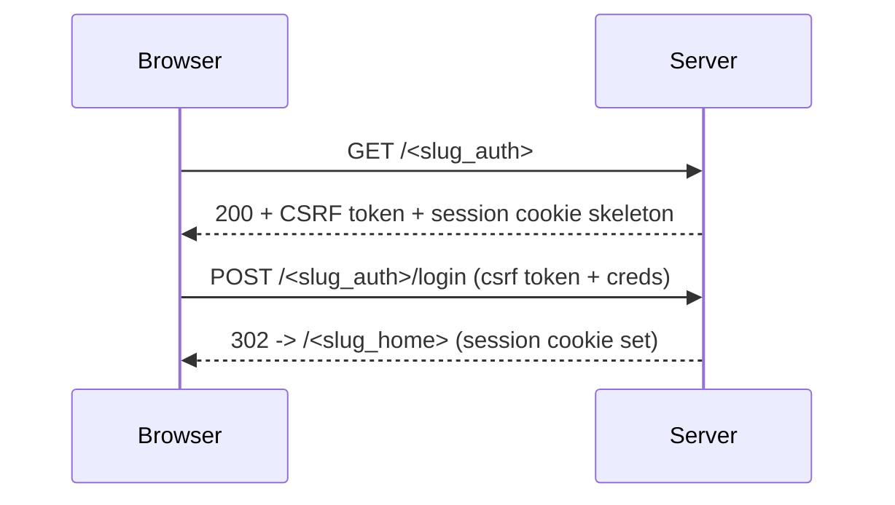

# IMPLEMENTATION PLAN: SSR Routes with Static Slug Entry and CSRF/Session Middleware

## Goals
- Implement SSR endpoints with non-guessable static slugs for sensitive pages.
- Add session and CSRF middleware consistent with SPEC #34.

## Routes (examples)
- GET `/<slug_auth>` — login form (SSR); POST requires CSRF token.
- POST `/<slug_auth>/login` — authenticate; set session cookie; redirect to `/<slug_home>`.
- POST `/<slug_auth>/logout` — invalidate session; redirect to `/<slug_auth>`.
- GET `/<slug_home>` — initial landing (SSR-only); includes nav links with configured slugs.
- GET `/<slug_health>` — obfuscated readiness for internal use only (loopback or mTLS + token).

## Middleware
- Session: HttpOnly, Secure, SameSite=strict; idle TTL (20m), absolute TTL (12h); rotation on privilege change.
- CSRF: synchronizer token + double-submit; header validation for API writes.
- RBAC Gate: check role per route; integrate with static slug config.
- Uniform 404s for unknown paths.

## Tasks
1) Config: `slug_auth`, `slug_home`, `slug_health` loaded at startup.
2) Middleware: session and CSRF layers; error normalizer.
3) SSR Templates: minimal pages for auth and home with nav links using slugs; no conventional path names.
4) Health: restrict to loopback or mTLS + token; return minimal body.
5) Tests: unit for CSRF/session; integration for login/logout flow and slug enforcement.

## Acceptance Criteria
- SSR slugs enforced; sessions and CSRF validated; auth->home flow works; unknown paths return uniform 404s.
