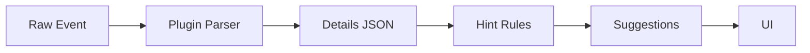

# SPEC: Diagnostics Schemas and Hints Generation

## Goals
- Normalize plugin-specific events into schemaed details and generate actionable hints.
- Map hints to safe configuration changes and UI suggestions.

## Non-Goals
- Advanced correlation beyond per-host/per-plugin context.

## Architecture Overview
- Parser modules per plugin normalize events; hint engine applies rules.

## Detailed Design
- Schemas (versioned):
  - AppArmor: profile, path, op, denied capability, suggested rule.
  - nftables: chain, verdict, tuple (src/dst/port/proto), suggested allow.
  - Coraza: rule_id, phase, uri, headers, anomaly, suggested header allowlist or exclusion.
- Hints:
  - Include confidence, impact, and a safe-apply flag.
  - Group duplicates; suppress noisy patterns; require explicit user approval.

## Security Posture
- No auto-apply by default; human-in-the-loop for changes.
- Redaction of sensitive fields in UI exports/log views.

## Operations
- Ruleset versioning; environment-specific exceptions.

## Acceptance Criteria
- Schemas defined; hint rules documented; UI surfaces actionable suggestions with diffs.

## Open Questions
- Thresholds for suppression and batching intervals.
