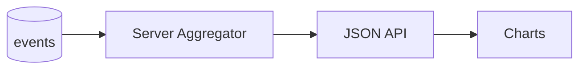

# SPEC: Graphing and Charts for Logs/Events

## Goals
- Visualize counts/rates by severity/source over time, and basic performance metrics.
- Keep the client lightweight and secure.

## Non-Goals
- Complex dashboarding; focus on essential observability.

## Architecture Overview
- Server pre-aggregates time-series buckets (e.g., 1m/5m) and serves JSON.
- Client renders with a minimal chart library.

## Detailed Design
- Aggregation endpoints: counts by severity, by source, by agent (grouped by interval)
- Libraries considered:
  - uPlot (fast, minimal)
  - Vega-Lite (declarative, larger payload)
- Recommendation: uPlot for performance and small footprint; no remote assets.
- Server returns compressed JSON with bounds; client enforces max points.

## Security Posture
- No third-party scripts; CSP enforced.
- Input bounds on query params; rate limits.

## Operations
- Aggregations use covering indexes and materialized views if needed.

## Acceptance Criteria
- Time-series APIs defined; UI renders severity/source charts for chosen range.

## Open Questions
- Do we require export (PNG/SVG) in v0?
