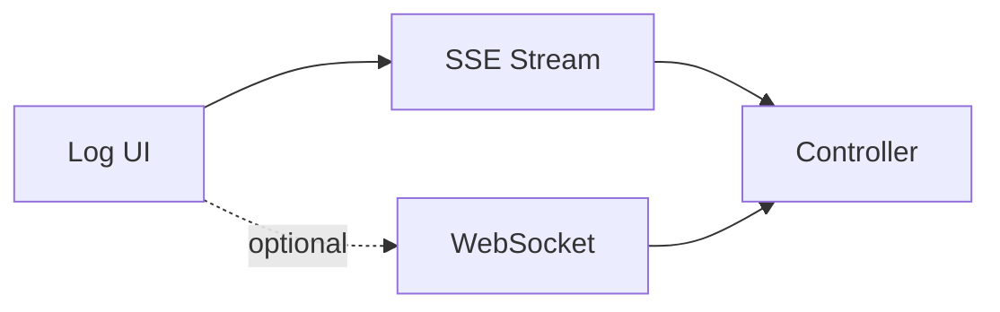

# SPEC: Live Log Transport — SSE vs WebSocket

## Goals
- Define transport for live tail with backpressure and security constraints.

## Non-Goals
- Historical search (covered elsewhere).

## Architecture Overview
- Default: Server-Sent Events (SSE) for simplicity and HTTP/2 support.
- Option: WebSocket for advanced backpressure control; requires stricter resource limits.

## Detailed Design
- SSE
  - One-way stream; heartbeat messages; reconnection with last-event-id.
  - Server enforces per-connection limits and filters at source.
- WebSocket (optional)
  - Two-way control: client applies fine-grained filters; server applies backpressure and windowing.
  - Strict message size and rate caps; authenticated session required.

## Security Posture
- Authenticated sessions; rate limits per connection; bounded message sizes.
- CSP maintained; no third-party sockets.

## Operations
- Default to SSE; allow WS in high-volume deployments; observability on dropped events.

## Acceptance Criteria
- SSE protocol documented; WS option documented with constraints; reconnection strategy defined.
