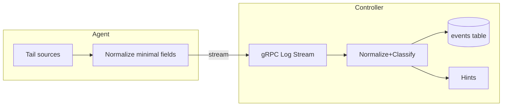

# SPEC: Log Streaming, Normalization, and Classification

## Goals
- Define an end-to-end pipeline to stream logs from agents, normalize them, classify severity, and make them filterable.
- Support live tail, historical queries, and plugin-aware parsing.

## Non-Goals
- UI wireframes (see Log UI SPEC).
- SIEM-scale correlation; focus on per-host/per-plugin diagnostics.

## Architecture Overview
- Agent tails local sources (journald, tool logs), parses minimal metadata, and streams over gRPC with optional message-level signatures.
- Controller validates, normalizes to a common envelope, persists to Postgres (partition-ready), and indexes for queries.
- Plugin parsers enrich events and emit hints.

## Detailed Design
- Severity taxonomy (normalized): RFC 5424 mapping
  - emerg(0), alert(1), crit(2), err(3), warn(4), notice(5), info(6), debug(7)
  - UI defaults expose: critical (emerg|alert|crit), error (err), warn, info, debug
- Sources: `source` string enum (e.g., apparmor, nftables, coraza, httpd, clamav, falco, agent)
- Details: JSONB payload with typed fields per plugin schema (versioned)
- Sequence: per-agent monotonic seq for dedup/ordering
- Integrity: optional Ed25519 signature of canonicalized JSON envelope

## Security Posture
- mTLS for transport; optional message signing for defense-in-depth.
- Size limits and rate limiting; per-agent quotas and backoff.
- Input validation: strict schemas; drop/flag malformed records.

## Operations
- Partition events by time (e.g., monthly) and index: ts, agent_id, source, level, GIN on details.
- Retention policy configurable per tenant/environment.

## Acceptance Criteria
- Agents can stream logs; controller stores normalized events with correct severity mapping.
- Queries can filter by severity, source, agent, and details fields.
- Enrichment hooks exist for plugin parsers to attach hints.

## Open Questions
- Do we include notice(5) in UI or treat as info?
- Do we need per-plugin custom levels mapped to normalized levels?
