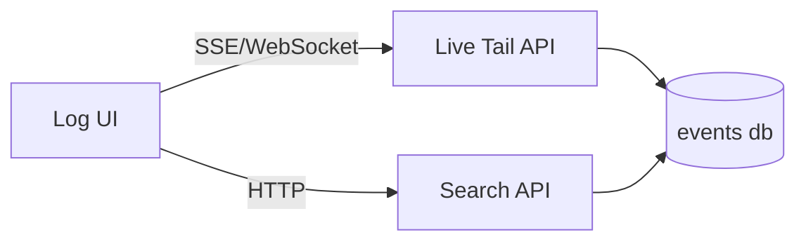

# SPEC: Log UI — Live Tail, Filters, and Drilldown

## Goals
- Provide an efficient live log view with severity filters and per-source filters.
- Support search, pause/resume, bookmarking queries, and drilldown to details/hints.

## Non-Goals
- Chart/time-series design (see Graphing SPEC).

## Architecture Overview
- UI queries a server endpoint for live tail (SSE/WebSocket) and for historical search (paged HTTP).
- Filters serialize to a query string for shareable bookmarks.

## Detailed Design
- Facets: severity (critical,error,warn,info,debug), source, agent, time range, text search, plugin fields
- Default view: last 15 minutes, auto-scroll live tail, pause toggle
- Columns: ts, agent, source, level, message excerpt, tags; expand for full details JSON and hints
- Saved views: named filters per user/team
- Clipboard-safe export for selected rows; redaction rules for sensitive fields

## Security Posture
- Server enforces per-tenant/RBAC on filters and results.
- Size/time bounds; rate limiting; paging enforced.
- CSP strict; no third-party scripts.

## Operations
- SSE preferred for simplicity; WebSocket allowed if needed for backpressure control.
- Query optimizer hints via indexes; cap results per page.

## Acceptance Criteria
- Live tail with pause/resume; filters function with normalized severity.
- Historical search with paging and export.
- Bookmarkable URLs for filter state.

## Open Questions
- Do we require regex search or substring only in v0?
- Saved view sharing across users by role?
