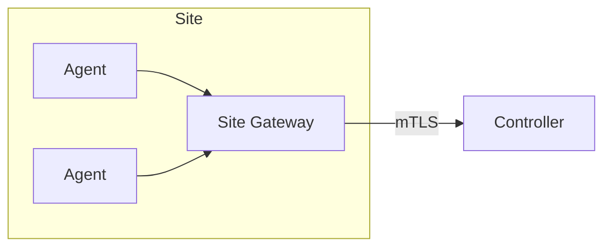

# SPEC: Site Gateway Topology (Optional)

## Goals
- Describe an optional site gateway for aggregating agents per network segment and reducing controller exposure in large deployments.

## Non-Goals
- Mandatory component; start with direct agent→controller.

## Architecture Overview
- Site gateway maintains outbound mTLS to controller; agents maintain outbound to gateway; gateway relays desired state and logs.

## Detailed Design
- Gateway: stateless relay with per-agent auth; optional local buffering; no long-term storage.
- Security: mTLS on both sides; per-agent identities pass-through; no password auth.

## Security Posture
- Limits inbound exposure; isolates failure domains; preserves end-to-end identities.

## Operations
- HA pair per site; monitoring and upgrade procedures; IP allowlists between sites.

## Acceptance Criteria
- Defined protocols and relay behaviors; optional deployment guide.
