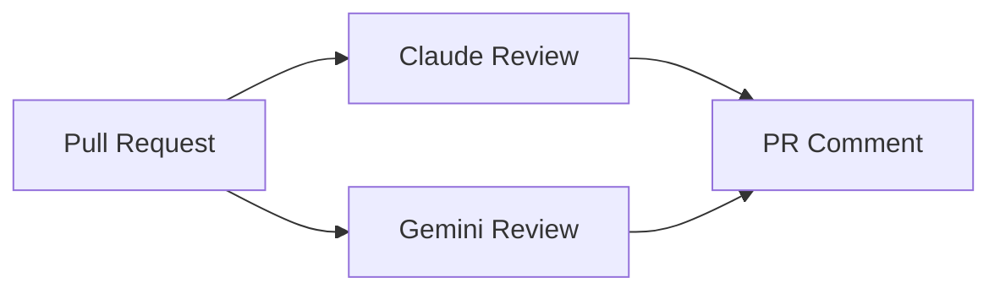

# SPEC: Automated Code Review (Claude + Gemini)

## Goals
- Provide automated PR feedback using Claude and Gemini with minimal friction and strong security posture.

## Architecture Overview
- GitHub Actions workflow triggers on PRs and posts review comments using:
  - Anthropic Claude (requires `ANTHROPIC_API_KEY` secret)
  - Google Gemini (requires `GOOGLE_API_KEY` secret)

## Setup
- Secrets:
  - `ANTHROPIC_API_KEY` — Anthropic API key
  - `GOOGLE_API_KEY` — Google AI Studio API key (Gemini)
- Permissions: workflow has `pull-requests: write` to post comments.

## Security Posture
- Diff limited to ~280KB to avoid overages; no repo secrets exposed; keys stored in repo secrets.

## Acceptance Criteria
- When secrets are set, PRs receive automated review comments from Claude and/or Gemini.
