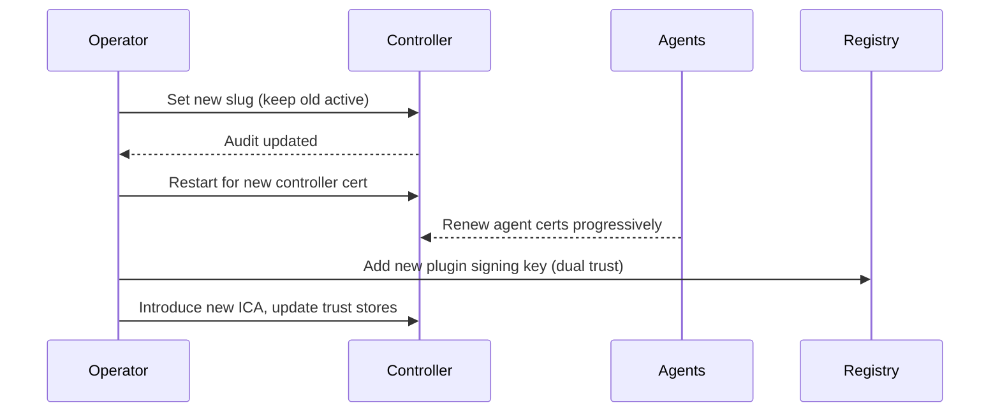

# SPEC: Operator Runbooks — Slugs, Certs, Keys, and CA Rotation

## Goals
- Document operator procedures for rotating sensitive materials: route slugs, TLS certs, plugin signing keys, and CAs.

## Non-Goals
- Automating all steps; focus on safe, auditable procedures.

## Architecture Overview
- Slugs: dual-slug window; update config; disseminate; audit accesses to old/new.
- Certs: weekly controller cert rotation via restart; agent renewal before TTL/3; emergency revoke.
- Keys: plugin signing key rotation with dual-trust window; registry index update.
- CA: rare operation; staged rollout with trust anchors; revoke old after cutover.

## Detailed Design
- Slug Rotation: generate >=20-char slug; update config; broadcast to admins; cutover window <=24h; deprecate old; optionally leave honey endpoint at old path.
- Cert Rotation: enforce weekly restart; controller regenerates if self-signed; otherwise fetch from CA; agents renew before TTL/3.
- Plugin Key Rotation: add new key to allowlist; re-sign critical plugins; update registry index; remove old after window.
- CA Rotation: introduce new ICA signed by root; update trust stores; reissue certs; revoke old ICA.

## Security Posture
- Changes are audited; keys stored securely; procedures require multi-party approval.

## Acceptance Criteria
- Runbooks cover slugs, certs, plugin keys, CA; include steps, validation, and rollback notes.
