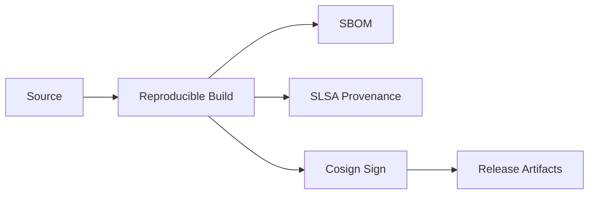

# SPEC: Supply Chain Security and Release Process

## Goals
- Secure build, verify, and release pipeline (reproducible, signed, auditable).

## Non-Goals
- Vendor-specific CI details.

## Architecture Overview
- Reproducible builds; SBOM (CycloneDX/SPDX); SLSA provenance; cosign signing.
- Dependency pinning and allowlist; cargo-deny; CodeQL; RustSec.

## Detailed Design
- CI: fmt, clippy, build, audit, govulnchecks; SBOM generation; provenance attestation.
- Signing: sign containers and binaries; verify on deploy; record in transparency log.
- Policies: dependency review; minimum review requirements; protected branches.

## Security Posture
- Defense against tampering via signed artifacts and provenance; vulnerability scanning in CI.

## Operations
- Release versioning and changelog; rollback procedures.

## OCI and Helm Chart Signing (K3s Deployments)

- **OCI image signing**: Alpine 3.22-based container images are signed with cosign using keyless (Fulcio) or key-pair mode; signatures stored in the OCI registry alongside the image.
- **Helm chart signing**: Charts are signed with `helm package --sign` using GPG keys; provenance files (`.prov`) distributed alongside chart tarballs.
- **Verification**: K3s nodes verify image signatures via cosign policy before pulling; Helm chart provenance verified before install/upgrade.
- **SBOM**: Generated during multi-stage build and attached as OCI artifact alongside the signed image.

## Acceptance Criteria
- Supply chain steps documented; artifacts signed and verifiable; SBOM available.
