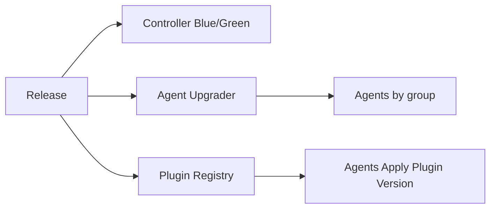

# SPEC: Upgrades — Controller, Agent, and Plugins

## Goals
- Define safe, signed upgrade flows with staged rollout and rollback for controller, agents, and plugins.

## Non-Goals
- Vendor package details.

## Architecture Overview
- Controller upgrades via blue/green; agents via signed packages with canary groups; plugins via registry with version pinning.

## Detailed Design
- Controller: health checks and traffic cutover; rollback on failure.
- Agent: signed bundle fetched over mTLS; staged rollout (percent or labels); rollback on health failure.
- Plugin: version pins per env; canary activation; auto-revert on error rate thresholds.

## Security Posture
- All artifacts signed; verification enforced before apply; audit logged.

## Operations
- Maintenance windows; rate limits on upgrades; observability on success/failure.

## Acceptance Criteria
- Documented upgrade plans and rollback for controller, agents, and plugins.
