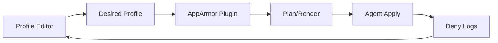

# SPEC: AppArmor — Logs and Configuration UI

## Goals
- Manage AppArmor profiles with validation and guided learning from deny logs.
- Offer per-service views and incremental policy updates.

## Non-Goals
- Full LSM training automation; we provide hints and safe applies.

## Architecture Overview
- UI edits desired profiles → plugin validates/renders → agent applies; logs parsed to propose rule additions.

## Detailed Design
- Editor supports path permissions, capabilities, network, file rules; diff viewer
- Hints generated from deny logs; review queue to accept/reject suggestions

## Security Posture
- Safe-apply with rollback; staging/testing before enforcement

## Operations
- Environment overlays; profile templates; export/import

## Acceptance Criteria
- Users can edit profiles, see diffs, apply changes, and triage deny-based hints
- Logs view filters for AppArmor denies with normalized severity

## Open Questions
- Learning mode thresholds and auto-suppress patterns?
