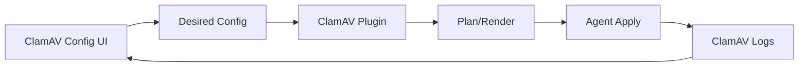

# SPEC: ClamAV — Logs and Configuration UI

## Goals
- Configure ClamAV (signatures, schedules, exclusions) and visualize detections/errors.

## Non-Goals
- Engine internals; focus on orchestration and diagnostics.

## Architecture Overview
- UI edits desired config → plugin validates/renders → agent applies; logs parsed for detections and errors.

## Detailed Design
- Config facets: signature DBs, update freq, scan schedules, path exclusions, on‑access scanning (if available)
- Logs: detections (path, signature), errors (permissions, missing defs)
- Hints: suggest exclusions or permission fixes based on errors

## Security Posture
- Scheduled scans avoid impacting critical paths; safe‑apply with rollback

## Operations
- Update mirrors; signature source configuration; quarantine path management

## Acceptance Criteria
- Configure and apply ClamAV settings; view detections; hints for remediation
