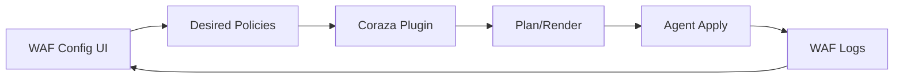

# SPEC: Coraza WAF — Logs and Configuration UI

## Goals
- Configure WAF policies (rulesets, exceptions, header handling) with validation and staged rollout.
- Visualize WAF blocks/alerts and recommend header/route adjustments.

## Non-Goals
- WAF engine internals; focus on config and diagnostics.

## Architecture Overview
- UI produces desired policies → plugin validates/renders for NGINX/Apache → agent applies; logs parsed for FP/FN triage.

## Detailed Design
- Config facets: rule sets, anomaly thresholds, exclusions, header allowlists, path-based policies
- Logs: align to severity; group by rule id; suggest header additions or rule tuning based on patterns

## Security Posture
- Safe rollouts with canaries; immediate rollback on elevated block rates

## Operations
- Import/export rule profiles; environment-specific overrides

## Acceptance Criteria
- Users can stage/apply WAF changes; monitor block rates and alerts
- Hints surfaced to adjust headers or tune rules with clear diffs

## Open Questions
- Built-in presets for common frameworks (e.g., Django, Rails)?
