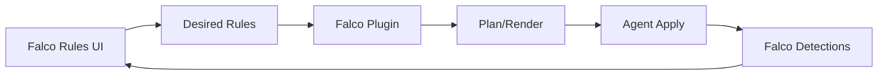

# SPEC: Falco — Logs and Configuration UI

## Goals
- Configure Falco rules and visualize security detections with tunings.

## Non-Goals
- Falco engine internals; focus on rule orchestration and diagnostics.

## Architecture Overview
- UI edits desired rules → plugin validates/renders → agent applies; logs parsed to group detections and propose tunings.

## Detailed Design
- Config facets: rule sets, enable/disable, exceptions, output channels
- Logs: detections grouped by rule and frequency; FP/FN triage assistance
- Hints: propose narrowing rules or adding exceptions based on patterns

## Security Posture
- Safe rollouts with canary and rollback on detection spikes

## Operations
- Rule set provenance; version pinning; environment overrides

## Acceptance Criteria
- Configure rules; monitor detections; receive tuning suggestions with diffs
