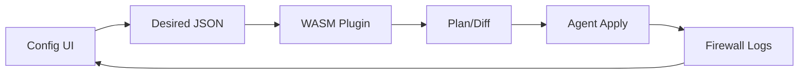

# SPEC: nftables — Logs and Configuration UI

## Goals
- Provide module-specific configuration (tables, chains, rules) with validation and diff plan.
- Offer logs filtered to firewall events with severity mapping and hints.

## Non-Goals
- Kernel interface details; handled by agent/helpers.

## Architecture Overview
- UI composes desired state (JSON) → plugin validates/renders → plan/apply via agent; logs parsed for decisions.

## Detailed Design
- Config facets: chains (input/forward/output), policies (accept/drop), rules (match, jump), NAT
- Validation: plugin schema; prevent lockout; dry-run simulation
- Logs: sources include kernel netfilter; normalized to warn/error/critical; hints suggest missing allow rules

## Security Posture
- Safe-apply with rollback; guardrails against severing controller connectivity

## Operations
- Staged rollout and canary; export/import configurations

## Acceptance Criteria
- Users can create/modify firewall rules, preview plan, apply, and monitor results
- Logs view filters by source=nftables with severity and hints

## Open Questions
- Preset rule templates per common services?
