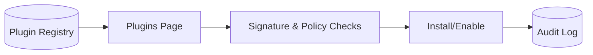

# SPEC: Plugin Registry and Install UI

## Goals
- Provide a secure interface to view, verify, install, update, and remove plugins.
- Ensure signature verification and capability review before activation.

## Non-Goals
- Plugin packaging details (see Plugin Packaging/Signing SPEC).

## Architecture Overview
- Plugin registry lists available signed versions; admin approves capability requests.

## Detailed Design
- Views: Catalog, Installed, Updates, Details (capabilities, schemas, versions)
- Flows: Install (verify signature, review capabilities), Update (diff), Remove (drain/disable)
- Security banner shows capabilities, hostcalls, resource limits

## Security Posture
- Only signed plugins; verification against trusted keys
- Capability-minimization; no network by default; resource limits shown

## Operations
- Rollback to prior plugin version; canary activation per subset of agents

## Acceptance Criteria
- Admin can verify and install a plugin; audit records capture actions
- Capability review mandatory before enablement

## Open Questions
- Do we allow site-local plugins (unsigned) in dev mode only?
