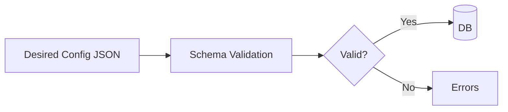

# SPEC: Plugin Config Schema Registry and Validation

## Goals
- Define versioned JSON schemas for plugin configs and a validation/upgrade path.

## Non-Goals
- UI; covered elsewhere.

## Architecture Overview
- Each plugin version declares a schema version; controller maintains registry of schemas and validators.
- Validation on submit and before apply; migration hooks for schema upgrades.

## Detailed Design
- Registry: mapping plugin_id/version -> schema_version and schema document (JSON Schema Draft 2020-12).
- Validation: jsonschema validation; custom constraints handled by plugin validate() export.
- Upgrades: migration spec from vN->vN+1; dry-run preview; audit trail.

## Security Posture
- Avoid dynamic code in validation; enforce size limits; sanitize error messages.

## Operations
- Schema addition requires review and signing; registry versioned; backward compatibility policy.

## Acceptance Criteria
- Schema registry and validation flows documented; migration path for schema upgrades specified.
