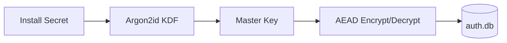

# SPEC: Internal Auth Store (Standalone Encrypted Credentials DB)

## Goals
- Provide a standalone, encrypted credentials database for internal user authentication (username/password), separate from PostgreSQL.
- Create a default admin user at install with a one-time password display and forced change on first login.
- Keep the entire application as a single Docker image; the auth store is embedded (no external service).

## Non-Goals
- Passkeys/WebAuthn (deferred for speed); this spec uses strong username/password only.

## Architecture Overview
- Encrypted on-disk store dedicated to auth data (users, password hashes, roles) at `/app/auth/auth.db` with strict permissions.
- AEAD envelope encryption using a master key derived from an installation secret (Argon2id KDF) and sealed with optional OS KMS/TPM (when available).

## Detailed Design
- Data model (auth.db)
  - users: id (uuid), username (unique), pass_hash (Argon2id), role (admin/editor/viewer), created_at, last_login_at, must_change_password (bool)
  - policy: password policy parameters (min length, charset, lockout thresholds)
- Crypto
  - Password hashing: Argon2id with per-user random salt, high cost parameters, and a global pepper from install secret.
  - Store encryption: XChaCha20-Poly1305 (or AES-256-GCM) envelope encryption for records; integrity protected; anti-rollback via monotonic counters in metadata.
  - Master key derivation: Argon2id(salt=install-id); optionally sealed by OS KMS/TPM on host to resist exfiltration; fallback to KDF-only if KMS unavailable.
- Default admin on install
  - Username: generated or fixed (e.g., admin); Password: generated high-entropy; printed ONCE to container logs and written to `/app/auth/INITIAL_ADMIN.txt` with `0600` perms.
  - `must_change_password=true` enforced at next login.
  - On first successful change, initial file is deleted and a tamper-evident audit entry recorded.
- Lockout and rate limits
  - N failed attempts → exponential backoff and temporary lockout; all auth attempts audited.
  - Session cookies with strict flags (see Sessions/CSRF SPEC) post-login.

## Security Posture
- Credentials never stored in PostgreSQL; isolated encrypted store mounted inside the single Docker image environment.
- No plaintext secrets on disk beyond the one-time initial admin file (auto-deleted on password change).
- Strong KDF and AEAD; optional OS KMS/TPM sealing.

## Operations
- Installation secret provided through a secure channel (env var or file mount) at first start; persisted as sealed material for subsequent restarts.
- Backup/restore: encrypted snapshot of `auth.db`; restoration requires installation secret (and KMS unsealing if used).

## Acceptance Criteria
- Default admin credentials displayed once on first run; force password change on first login.
- Auth store encryption with Argon2id + AEAD; isolated from PostgreSQL.
- Lockout/rate limits enforced; audit records for auth events.
