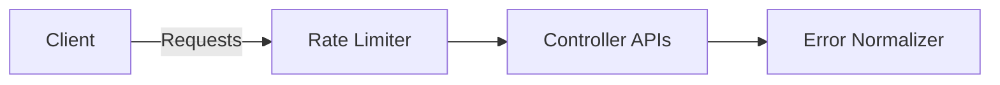

# SPEC: Error Model, Rate Limiting, and DoS Controls

## Goals
- Define error taxonomy and client behaviors; implement rate limits and DoS protections.

## Non-Goals
- WAF functionality; this is transport/app-level hardening.

## Architecture Overview
- gRPC errors map to retry policies; HTTP errors normalized; rate limits per IP/agent/identity.

## Detailed Design
- Error taxonomy: retryable (UNAVAILABLE, DEADLINE_EXCEEDED), client faults (INVALID_ARGUMENT), auth (UNAUTHENTICATED, PERMISSION_DENIED), resource (NOT_FOUND), rate (RESOURCE_EXHAUSTED).
- Rate limits: token bucket per IP, per agent ID; burst and sustained caps; ban lists on abuse.
- Body and field size limits; timeouts; connection concurrency limits; slowloris protection.
- Uniform error bodies to resist fingerprinting; correlation IDs for tracing.

## Security Posture
- Prevent resource exhaustion; avoid detailed error leakage; bounded inputs.

## Operations
- Configurable limits per deployment; observability on rejects; allowlist for critical paths.

## Acceptance Criteria
- Error mapping table and retry guidance defined; limits configurable and enforced; metrics on rejections.

## Open Questions
- Global vs per-tenant limits defaults.
