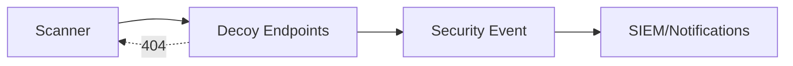

# SPEC: Honey Endpoints and Alerting

## Goals
- Deploy decoy endpoints at conventional paths to detect scanning and probing.
- Generate low-severity alerts and telemetry without leaking sensitive details.

## Non-Goals
- Blocking at the app layer; use network controls and rate limits separately.

## Architecture Overview
- App exposes decoy routes (e.g., `/login`, `/admin`, `/health`) returning uniform 404s externally but emitting security events internally.
- Alerts route to SIEM/notifications with throttling.

## Detailed Design
- Decoy routes return indistinguishable 404s (latency and body); no headers identifying technology.
- Events include: path, method, source IP, user agent, rate, correlation ID.
- Thresholds: burst and sustained; escalate severity on sustained targeting; tie into rate limiter for temporary bans.
- Privacy: redact PII; do not log full payloads.

## Security Posture
- Adds detection without exposing surfaces; complements route obfuscation.

## Operations
- Configurable decoys; throttle duplicate alerts; dashboards for trend analysis.

## Acceptance Criteria
- Decoys active; events generated on probes; alerts throttled; no sensitive leakage in responses.
