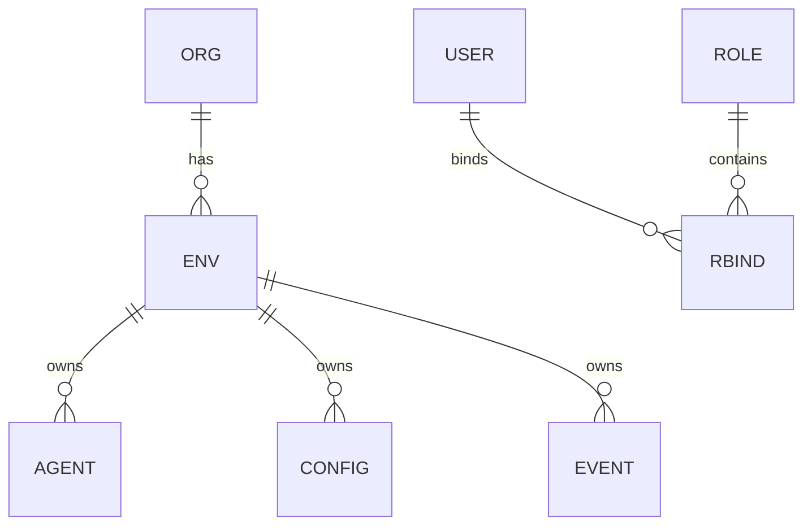

# SPEC: Tenancy, RBAC, and Postgres RLS

## Goals
- Define tenancy model and role-based access control for users and automation.
- Enforce data isolation via Postgres RLS policies.

## Non-Goals
- UI for tenancy management (covered in Users spec).

## Architecture Overview
- Tenancy: organizations → environments (prod/stage/dev) → resources (agents, configs, logs).
- RBAC: roles with scoped permissions; optional ABAC with labels/tags.
- Data isolation: RLS policies per tenant/environment.

## Detailed Design
- Roles: admin, ops, viewer; per-plugin grants (read/config/apply).
- RLS Strategy:
  - Tables include `tenant_id` and `env` columns.
  - Session sets `app.tenant_id` and `app.env` via `SET LOCAL` on request start.
  - Policies restrict `tenant_id = current_setting('app.tenant_id')::uuid` and env membership.
- Cross-tenant operations forbidden except via explicit admin tasks.

## Security Posture
- All queries executed with session-local tenant/env context; no superuser in app flows.
- Audit RLS policy hits/misses in pgaudit for sensitive tables.

## Operations
- Onboarding process to create org/env scaffolding.
- Role change propagation and emergency access procedure with audit.

## Acceptance Criteria
- RLS policies defined for core tables; test matrices show isolation.
- RBAC permissions matrix documented and enforced in service layer.

## Open Questions
- ABAC label semantics for large fleets.
