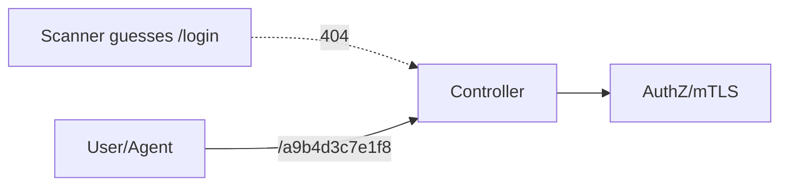

# SPEC: Sensitive Route Naming and Obfuscation Policy

## Goals
- Reduce discoverability of sensitive endpoints (auth entry, admin shell, readiness checks) without relying on obscurity as a primary control.
- Provide configurable, non-guessable slugs for sensitive pages and services.
- Standardize response behavior to resist enumeration and fingerprinting.

## Non-Goals
- Replacing strong authentication/authorization, mTLS, or network controls; this is an additional layer.

## Architecture Overview
- Sensitive endpoints are not exposed at conventional paths (e.g., `/login`, `/admin`, `/dashboard`, `/health`, `/status`).
- A deployment-specific secret slug (e.g., `/a9b4d3c7e1f8`) maps to each sensitive entrypoint.
- Slugs are configured via secure config and may rotate with cutover windows.

## Detailed Design
- Slug format: at least 16 random bytes, base32/base62 encoded; length >= 20 characters.
- Rotation: dual-slug support for rolling transitions (old+new valid for <= 24h), audit logged.
- Response normalization:
  - Unknown paths return 404 with identical body/latency across variants.
  - No server banners or stack traces; minimal error bodies.
  - Health/readiness endpoints return 404 externally, and are reachable only via loopback or mTLS + header token.
- Canary endpoints: optional honey paths (`/login`, `/admin`, `/health`) trigger low-severity alerts upon access attempts.
- UI naming: avoid “login” / “dashboard” in URLs, code, and static asset names; prefer neutral component names in bundles.

## Security Posture
- Primary controls remain: mTLS (for agents), WebAuthn/OIDC, RBAC, CSRF/CSP, rate limits.
- Obfuscation reduces automated scanning effectiveness and noise; not a replacement.

## Operations
- Slug secrets managed like credentials (rotation process, access controls).
- Documented runbook for slug rotation and client communication.

## Acceptance Criteria
- Sensitive endpoints are accessible only via configured slugs; no obvious paths exist.
- Unknown path responses are uniform; no differentiation that aids scanners.
- Health/readiness are not exposed at common names and are restricted to secure contexts.
- Optional honey endpoints produce alerts when probed.

## Open Questions
- Default rotation cadence for slugs? Triggered on major releases only?
- Require IP allowlists for admin routes in addition to slugs?
