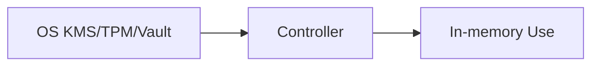

# SPEC: Secrets Management (DB creds, keys, tokens)

## Goals
- Define secure handling for secrets: storage, access, rotation.

## Non-Goals
- Full Vault/KMS setup guides.

## Architecture Overview
- Secrets sourced from OS keyring/KMS/Vault; injected as env vars or files with strict perms; in-memory use only.

## Detailed Design
- Storage: prefer OS KMS (TPM-backed) on agents; Vault or KMS for controller.
- Access: least privilege; no secrets in logs; zero-trust between components beyond issued credentials.
- Rotation: DB creds, API tokens, signing keys; runbooks and automation hooks.

## Security Posture
- Secrets never committed; minimal lifetime in memory; secure file perms when needed.

## Operations
- Secret owners and rotation cadence documented; audit of secret access.

## Kubernetes Secrets (K3s Deployments)

- **K3s secrets encryption**: K3s is configured with `--secrets-encryption` to encrypt Secrets at rest in etcd using AES-CBC or AES-GCM.
- **Kubernetes Secrets as source**: Application pods mount secrets via `secretRef` environment variables or volume mounts; secrets are created by operators or CI/CD pipelines.
- **External Secrets Operator** (optional): For production deployments, `external-secrets-operator` syncs secrets from Vault, AWS Secrets Manager, or other backends into Kubernetes Secrets, providing a single abstraction layer.
- **Rotation**: External Secrets Operator handles rotation by re-syncing from the backend on a configurable interval; pods pick up new secrets via rolling restart or projected volume refresh.

See [K3s Infrastructure Spec](../deploy/k3s_infrastructure_spec.md) for cluster-level security configuration.

## Acceptance Criteria
- Secrets flows documented; rotation procedures exist; integration points with KMS/Vault identified.
