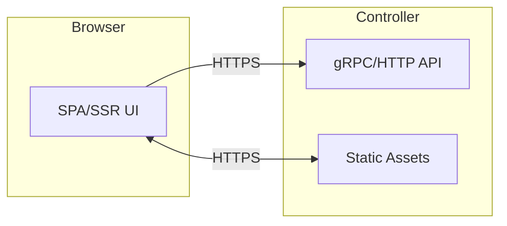

# SPEC: UI Framework, Styling, and Shell

## Goals
- Define front-end stack and styling conventions for a secure, operable admin UI.
- Balance developer velocity with supply-chain and runtime risk.
- Enable accessible, consistent components with minimal bespoke CSS.

## Non-Goals
- Implementing the UI; this PR sets standards and system design only.
- Choosing a charting lib (see Graphing SPEC).

## Architecture Overview
- Server-side: Rust (axum) serves API and static assets.
- Front-end options:
  - Option A: SSR-first with minimal JS (htmx + Alpine.js) and Tailwind core.
  - Option B: React + Tailwind + shadcn/ui (Radix primitives) for rich components.
- We harden build pipeline and restrict third-party scripts via strict CSP (nonces, no inline eval).

## Detailed Design
- Default (hardened): SSR-first (Option A) for all sensitive and admin surfaces (auth entry, initial landing, admin controls, health/readiness) using htmx + Tailwind core. Routes must follow the routing obfuscation policy (non-guessable slugs; no conventional names).
- App surfaces (post-auth, non-admin views): Option B (React + Tailwind + shadcn/ui) acceptable under pinned/hardened builds; progressive enhancement only.
- Common guidelines:
  - CSP: `default-src 'self'; script-src 'self' 'nonce-<rand>'; object-src 'none'; frame-ancestors 'none'`. No third-party JS/CDN.
  - No client-side secrets; all secrets remain server-side.
  - Components must be keyboard-accessible; color contrast checks.
  - Theming via CSS variables and Tailwind tokens.
  - Avoid client-side routing for critical admin flows; prefer server validation.
  - Sensitive pages must not be named "login", "dashboard", "health", etc.; use deployment-specific non-guessable slugs.

## Security Posture
- Strict CSP; no inline scripts without nonces; no remote scripts.
- Integrity-checked assets; asset hashing; subresource integrity when feasible.
- Build pipeline pinned, SBOM generated; dependency review and allowlist.

## Operations
- Build artifacts are baked into the controller image (immutable).
- Feature flags for Option A vs Option B builds.

## Acceptance Criteria
- Decision recorded: SSR-first for sensitive/admin surfaces; React permitted for non-admin post-auth views.
- Routing obfuscation enforced; CSP policy defined and enforced across pages.
- Accessibility checklist documented for components.

## Open Questions
- Do we require a no-Node build path for classified environments by default?
- Which non-admin areas, if any, can opt into React by default?
