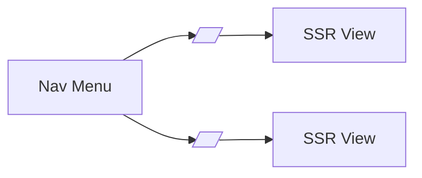

# SPEC: UI Navigation and Obfuscated Routing

## Goals
- Define navigation structure that does not leak sensitive route names and uses deployment-specific slugs.
- Maintain usability and accessibility without conventional path names.

## Non-Goals
- Visual design; see UI framework SPEC.

## Architecture Overview
- All top-level sensitive routes are configured via slugs; navigation links use those slugs and human-friendly labels.
- Robots and indexing disabled; authenticated-only UI; no exposure of paths prior to auth.

## Detailed Design
- Slug map: configuration structure providing current and (optionally) next slugs for rotation.
- Anchors: href use slugs; labels are human-friendly but do not include sensitive keywords (e.g., avoid "Admin").
- Breadcrumbs: generated from labels, not from path segments.
- No canonical URLs disclosed publicly; strict noindex and no-referrer meta.

## Security Posture
- Obfuscated paths; SSR with CSRF; no path hints in HTML comments or JS bundles.

## Operations
- Slug rotation: dual mapping supported; nav updates automatically from config.

## Acceptance Criteria
- Navigation uses slug-based hrefs; no conventional path names; breadcrumbs derived from labels; no indexing.
