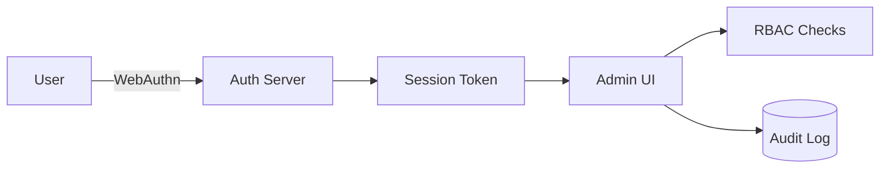

# SPEC: User Accounts, AuthN/Z, and Admin UX

## Goals
- Provide secure user authentication (WebAuthn/FIDO2; optional OIDC) and role-based authorization.
- Deliver an admin UX for user/role management and audit viewing.

## Non-Goals
- Full IdP feature set; we integrate with OIDC where needed.

## Architecture Overview
- Auth core: WebAuthn resident keys; backup codes; optional OIDC login.
- Roles: RBAC with scoped permissions; audit trail for user actions.

## Detailed Design
- Roles: admin, ops, viewer; plugin-specific grants (read/config/apply)
- Sessions: short-lived, HTTP-only, SameSite=strict cookies
- Login UI: WebAuthn first; OIDC as enterprise option
- Admin pages: Users, Roles, Role bindings, Audit viewer

## Security Posture
- Strong passwordless default; CSRF and XSS protections; strict CSP
- Admin surface RBAC-hardened; tamper-evident audit

## Operations
- Backup code lifecycle; role change propagation; audit export

## Acceptance Criteria
- WebAuthn login works; RBAC gates routes; admin can manage users/roles
- All admin actions are audited

## Open Questions
- Do we require SAML in addition to OIDC?
