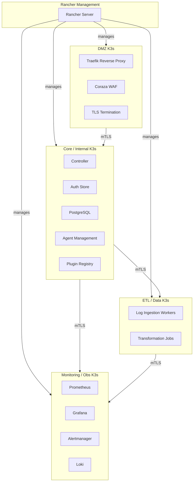

# Architecture

## Overview

SWAP uses a multi-cluster K3s topology to enforce strict network isolation between trust zones. Each cluster runs its own control plane, CNI (Cilium), and etcd — there is no shared overlay network.

## Technology Stack

| Layer | Technology | Purpose |
|-------|-----------|---------|
| **Runtime** | K3s | Lightweight Kubernetes distribution |
| **CNI** | Cilium | eBPF-based networking + network policies |
| **Ingress** | Traefik | Reverse proxy with Coraza WAF sidecar |
| **Identity** | SPIFFE/SPIRE | Workload identity + mTLS certificates |
| **Certificates** | cert-manager | Automated certificate lifecycle |
| **Storage** | Longhorn | Distributed block storage for StatefulSets |
| **Fleet** | Rancher Fleet | GitOps multi-cluster management |
| **Language** | Rust | All SWAP services compiled as musl-static binaries |
| **Images** | Alpine 3.22 | Minimal runtime base image |

## Container Image Pipeline

All SWAP images follow a two-stage build:

1. **Builder stage** — `rust:1.87-alpine3.22` compiles the binary with `RUSTFLAGS='-C target-feature=+crt-static'`
2. **Runtime stage** — `alpine:3.22` with only the static binary, CA certificates, and a non-root user

No shell, no package manager, no debugging tools in production images.

## Inter-Cluster Communication

Clusters communicate over routable IPs with mTLS. There is no shared overlay network or VPN tunnel. Each cluster's Cilium CNI manages its own pod network independently.

Cross-cluster traffic is restricted by:

- Cilium `CiliumNetworkPolicy` on egress
- Firewall rules on the host network
- mTLS certificate validation (SPIFFE trust domain per cluster)
